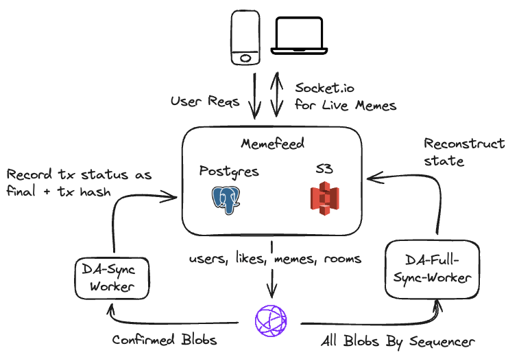

# Memefeed

Memefeed is a sovereign app chain that enables live memes for every community.

[Dorahacks Buidl](<https://dorahacks.io/buidl/12713>)
[Demo Video](<https://www.youtube.com/watch?v=xcMi5EfuPAo>)

I hope to have more robust documenation later on. For now, here's the basic gist:

1. **Data Posting to Celestia**
   - Memefeed posts data to Celestia directly using a single sequencer (this node).

2. **Data Format**
   - The [format](https://github.com/memefeed-labs/memefeed/blob/main/src/resources/celestia.ts#L45-L50) of the data is a series of blobs that allows another full node to reconstruct the state.

3. **Transaction Recording**
   - (Implemented) The sequencer records a transaction as pending initially.
   - (Not Implemented) A DA worker reads confirmed blobs and updates the transaction status to final (or defaults to the status provided by the DA).

4. **Node Synchronization (Not Currently Implemented)**
   - A sync worker would read all blobs and reconstruct the Postgres table to sync a new node for verification.

5. **Image Verification (Not Currently Implemented)**
   - Currently, image data is stored on S3. A data storage network or verification methods are yet to be determined. In theory, a light client could verify execution accuracy as well as proper storage of image data (download 1x/day, etc). Open to ideas.

6. **Transaction Payment**
   - Currently, the sequencer pays for transactions as long as the user is authenticated (via a transaction signature & JWT token).
   - Future plans include using packs a la carte or subscriptions for payments.
   - Contributors would be rewarded (TBD - tipping, memecoins, etc).

7. **Token**
   - A token could enable DA-diversity, allowing posts to multiple DAs.

8. **Room Metadata Privacy (Future)**
   - Ensuring privacy for room metadata so that what happens in a room, stays in a room.

## Design Details

1. [Data Models (Postgres - inital bytes per record are estimated for blobs)](https://github.com/memefeed-labs/memefeed/blob/main/src/resources/memes-pg.ts)
2. [API Endpoints](https://github.com/memefeed-labs/memefeed/blob/main/src/app.ts)
3. [Celestia](https://github.com/memefeed-labs/memefeed/blob/main/src/resources/pg.ts#L38)

## Backlog

Feel free to ignore. These are some open items from the hackathon I noted down. I'll pull them out into a separate planning document later.

1. Add basic image spam filtering
2. Productionize
   1. Configure S3 AWS IAM (sequencer has post access only for prod bucket)
   2. Routes (internal, rate limiting, etc)
   3. fly.io / neon.tech for instances / postgres
3. Convert to more RESTful routes / grpc
   1. Response schema validation
   2. Convert responses to include error, status, result
   3. Eliminate redudant use of userID and roomID in request params, use req.auth (Session)
4. Perf Optimizations
   1. (GET memes endpoints) Implement pagination & offset to optimize performance.
   2. (pgConnect.ts) socket.io - send as new_meme_roomId to optimize client side
5. Celestia
   1. Robust typescript client
   2. DA-Confirm-Sync-Worker
   3. DA-Full-Sync-Worker
